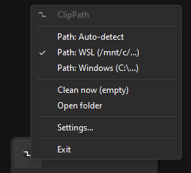
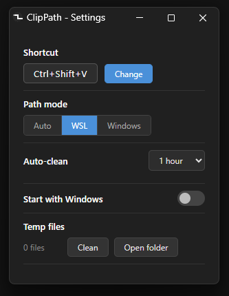
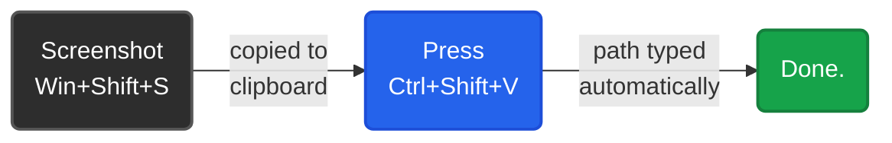
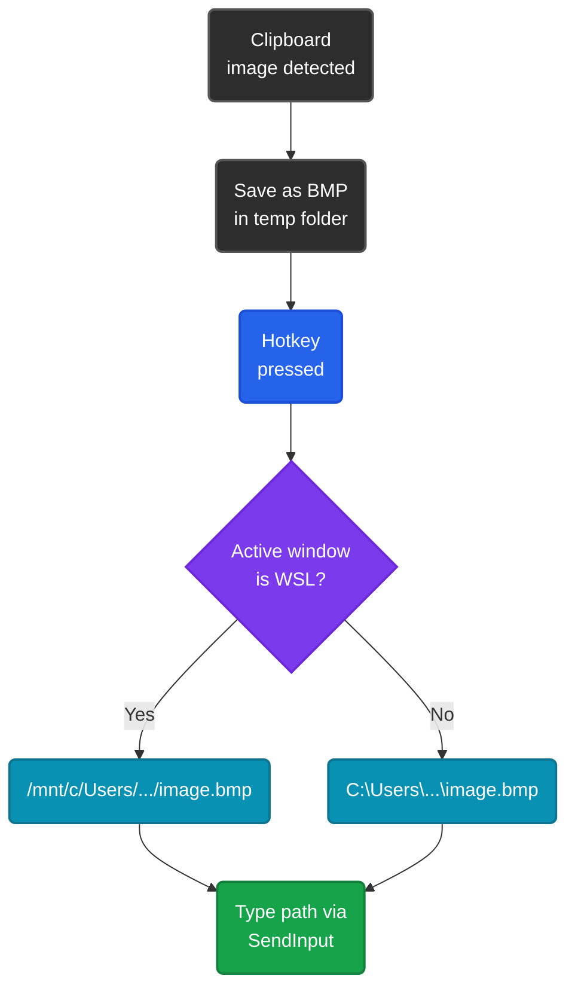
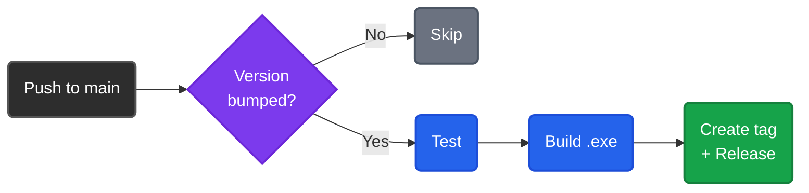

<div align="center">


# ClipPath

**Paste screenshots as file paths in your terminal.**

Built for developers who use [Claude Code](https://docs.anthropic.com/en/docs/claude-code),
[OpenAI Codex CLI](https://github.com/openai/codex), [OpenCode](https://github.com/opencode-ai/opencode),
and other AI coding agents in Windows and WSL terminals.

[](https://github.com/BiteCraft/ClipPath/releases/latest)
[](https://github.com/BiteCraft/ClipPath/actions)
[](#tests)
[](#)
[](#license)

**[Download latest release](https://github.com/BiteCraft/ClipPath/releases/latest)** &mdash; single `.exe`, no install needed.

<br>

&nbsp;&nbsp;&nbsp;&nbsp;

</div>

---

## Why ClipPath Exists

If you use **Claude Code**, **Codex CLI**, or any AI coding agent in a terminal, you've hit this wall:

> You need to share a screenshot with the AI, but the terminal only accepts **file paths**.

You screenshot the error, the UI, the diagram &mdash; and then you're stuck. Save the image somewhere, navigate to it, copy the full path, paste it. Every. Single. Time.

**ClipPath eliminates that entire workflow.**



The image is saved instantly and the path is typed character-by-character into your active window &mdash; whether that's a WSL terminal running Claude Code, a Windows PowerShell with Codex CLI, or any other app.

### Works where you need it

| Tool | Terminal | Path format |
|------|----------|------------|
| **Claude Code** | WSL (Ubuntu, Debian, etc.) | `/mnt/c/Users/.../image.bmp` |
| **Claude Code** | Windows Terminal / PowerShell | `C:\Users\...\image.bmp` |
| **Codex CLI** | Any terminal | Auto-detected |
| **OpenCode** | Any terminal | Auto-detected |
| Any app | File dialogs, chat, IDEs | Auto-detected |

ClipPath **auto-detects** whether your active terminal is WSL or Windows and outputs the correct path format. No configuration needed.

---

## Quick Start

### Download (recommended)

1. Go to [**Releases**](https://github.com/BiteCraft/ClipPath/releases/latest)
2. Download `clippath.exe`
3. Run it &mdash; ClipPath appears in your system tray

That's it. Single portable `.exe`, no installation, no dependencies.

### Build from source

```bash
# Requires Bun v1.3.9+ and Windows 10/11
git clone https://github.com/BiteCraft/ClipPath.git
cd clippath
bun install
bun run build       # → builds/clippath.exe
```

---

## How It Works



1. **Monitors** the clipboard for images via Win32 `AddClipboardFormatListener`
2. **Saves** the image as a timestamped BMP in `%TEMP%\clippath\`
3. On hotkey press, **detects** if the active window is WSL (via window title heuristics)
4. **Types** the file path character-by-character via `SendInput` &mdash; works everywhere, no paste conflicts

All Win32 API calls go through Bun's FFI. No native modules, no C++ addons, no Electron.

---

## Features

<table>
<tr>
<td width="50%">

### Core
- **Clipboard monitoring** &mdash; detects images instantly
- **Global hotkey** &mdash; Ctrl+Shift+V (customizable)
- **Auto-typing** &mdash; types path via SendInput, no paste conflicts
- **Smart caching** &mdash; press again to re-type the same path

### Path Modes
- **Auto-detect** &mdash; reads window title to pick format
- **WSL** &mdash; always outputs `/mnt/c/...` paths
- **Windows** &mdash; always outputs `C:\...` paths

</td>
<td width="50%">

### Settings Window
- Dark-themed native-looking UI (Edge --app)
- Change hotkey with live key capture
- Configure path mode, cleanup schedule, autostart
- Clean temp files and open folder

### Quality of Life
- **Auto-cleanup** &mdash; off, 30min, 1h, 6h, or daily
- **Start with Windows** &mdash; registry-based autostart
- **No console window** &mdash; runs silently in the tray
- **Balloon notifications** &mdash; know when it's ready

</td>
</tr>
</table>

### WSL Auto-Detection

When **Auto-detect** is enabled, ClipPath checks the foreground window title for:

| Pattern | Example | Result |
|---------|---------|--------|
| Linux distro names | `Ubuntu`, `Debian`, `Kali` | WSL path |
| Shell indicators | `bash`, `zsh`, `user@host:` | WSL path |
| Unix paths | `/home/`, `/mnt/c/`, `~/` | WSL path |
| Everything else | `PowerShell`, `cmd`, VS Code | Windows path |

---

## Configuration

Config file: `%APPDATA%\clippath\config.json`

```json
{
  "shortcut": "Ctrl+Shift+V",
  "wslMode": null,
  "cleanupSchedule": "1h",
  "dailyHour": 3
}
```

| Field | Values | Default |
|-------|--------|---------|
| `shortcut` | Any `Modifier+Key` combo | `Ctrl+Shift+V` |
| `wslMode` | `null` (auto), `true` (WSL), `false` (Windows) | `null` |
| `cleanupSchedule` | `off`, `30m`, `1h`, `6h`, `daily` | `1h` |
| `dailyHour` | `0`-`23` (hour for daily cleanup) | `3` |

---

## Architecture

```
src/
├── main.ts                          Entry point
├── config.ts                        JSON config persistence
├── hotkey.ts                        Global hotkey via RegisterHotKey
├── wsl.ts                           Path conversion & mode management
├── wsl-detection.ts                 Window title heuristics
├── autostart.ts                     Registry-based startup
│
├── app/
│   ├── lifecycle.ts                 Startup sequence & shutdown
│   ├── hotkey-handler.ts            Image extract → save → paste pipeline
│   └── cleanup-scheduler.ts         Timed auto-cleanup
│
├── clipboard/
│   ├── monitor.ts                   WM_CLIPBOARDUPDATE listener
│   └── extract.ts                   DIB data extraction
│
├── image/
│   ├── bmp.ts                       DIB → BMP format conversion
│   └── temp-files.ts                File save, count, cleanup
│
├── input/
│   ├── keyboard.ts                  SendInput text typing
│   ├── key-events.ts                INPUT struct building
│   ├── key-state.ts                 Keyboard layout detection
│   ├── shortcut.ts                  Shortcut parse/format
│   └── clipboard-paste.ts           High-level paste API
│
├── window/
│   ├── message-window.ts            Hidden Win32 HWND
│   ├── message-loop.ts              Non-blocking message pump
│   └── message-bus.ts               Message → handler dispatch
│
├── tray/
│   ├── icon.ts                      System tray icon management
│   ├── handler.ts                   Click & menu message routing
│   ├── menu-builder.ts              Context menu construction
│   ├── menu-commands.ts             Menu action handlers
│   └── shortcut-capture.ts          Tray-initiated key capture
│
├── settings/
│   ├── server.ts                    HTTP server + Edge --app launcher
│   ├── page.ts                      Embedded HTML/CSS/JS dark UI
│   ├── api.ts                       REST API handlers
│   └── shortcut-capture-api.ts      Browser-driven capture state machine
│
└── win32/
    ├── constants.ts                 Win32 constants
    ├── structs.ts                   Struct builders (WNDCLASS, MSG, INPUT, etc.)
    ├── user32.ts                    user32.dll FFI bindings
    ├── kernel32.ts                  kernel32.dll FFI bindings
    ├── gdi32.ts                     gdi32.dll FFI bindings
    ├── shell32.ts                   shell32.dll FFI bindings
    └── uxtheme.ts                   Dark mode support
```

### Tech Stack

| Layer | Technology |
|-------|-----------|
| Runtime | [Bun](https://bun.sh) &mdash; compile, bundle, test, serve |
| Language | TypeScript (strict mode, ESNext) |
| Win32 API | `bun:ffi` &mdash; direct FFI to 5 system DLLs |
| Settings UI | Embedded HTML/CSS/JS + Edge `--app` mode |
| Linting | [Biome](https://biomejs.dev) |
| CI/CD | GitHub Actions &mdash; test, build, release |
| Dependencies | **Zero** runtime dependencies |

---

## Tests

```bash
bun test
```

```
173 pass
  0 fail
230 expect() calls
Ran 173 tests across 18 files. [254ms]
```

<details>
<summary><strong>Full test coverage breakdown</strong></summary>

| Module | Test File | What's Covered |
|--------|-----------|----------------|
| Config | `config.test.ts` | Load, save, merge, defaults, validation |
| Clipboard | `monitor.test.ts` | State tracking, callbacks |
| Cleanup | `cleanup-scheduler.test.ts` | All schedule modes, timer management |
| Autostart | `autostart.test.ts` | Registry enable/disable/status |
| Hotkey | `hotkey.test.ts` | Registration, dispatch |
| Keyboard | `keyboard.test.ts` | Layout detection, input events |
| Key Events | `key-events.test.ts` | INPUT struct building |
| Key State | `key-state.test.ts` | Async key state |
| Shortcuts | `shortcut.test.ts` | Parse, format, validation |
| BMP | `bmp.test.ts` | DIB → BMP header conversion |
| Temp Files | `temp-files.test.ts` | Save, count, cleanup, paths |
| Win32 Structs | `structs.test.ts` | NOTIFYICONDATA, wide strings |
| Message Bus | `message-bus.test.ts` | Handler registration, dispatch |
| Message Loop | `message-loop.test.ts` | Pump start/stop |
| Message Window | `message-window.test.ts` | HWND creation |
| WSL | `wsl.test.ts` | Path conversion |
| WSL Detection | `wsl-detection.test.ts` | Terminal heuristics |
| Menu Commands | `menu-commands.test.ts` | All tray menu actions |

</details>

---

## Development

```bash
bun start              # Run in dev mode
bun test               # Run tests
bun run typecheck       # Type checking
bun run lint            # Lint with Biome
bun run format          # Format with Biome
bun run build           # Build standalone exe
```

### Releasing

Bump the version in `package.json` and push to `main`. The CI pipeline automatically detects the version change and only runs when the version is higher than the previous one:

```bash
# Edit package.json → "version": "1.1.0"
git add package.json
git commit -m "Bump version to 1.1.0"
git push origin main
```



Pushes without a version bump are ignored &mdash; no unnecessary builds.

---

## License

MIT
